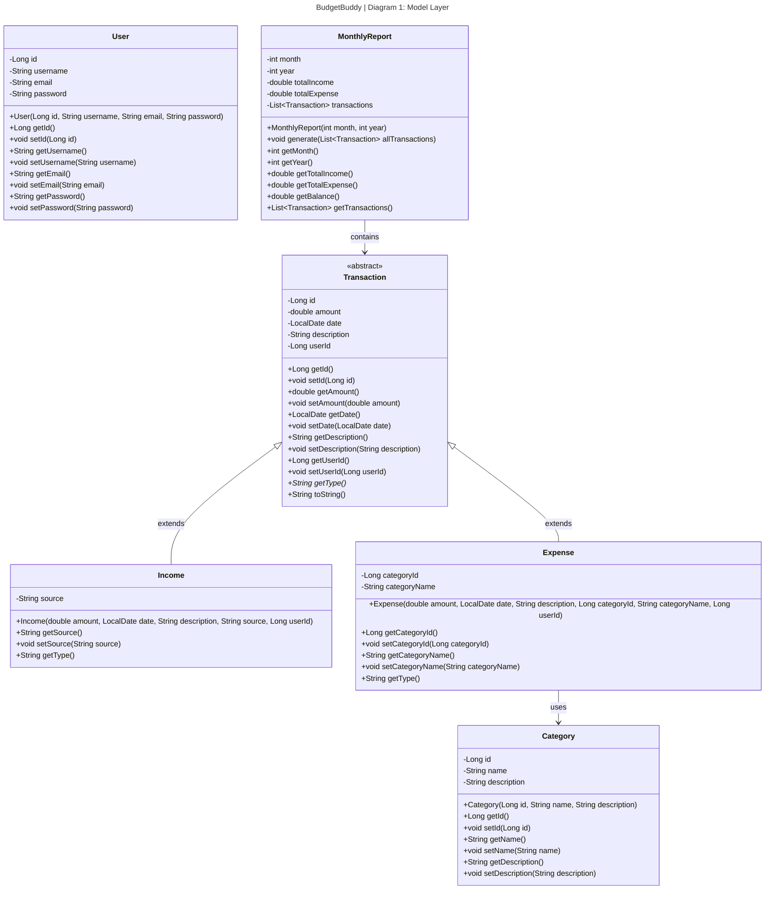
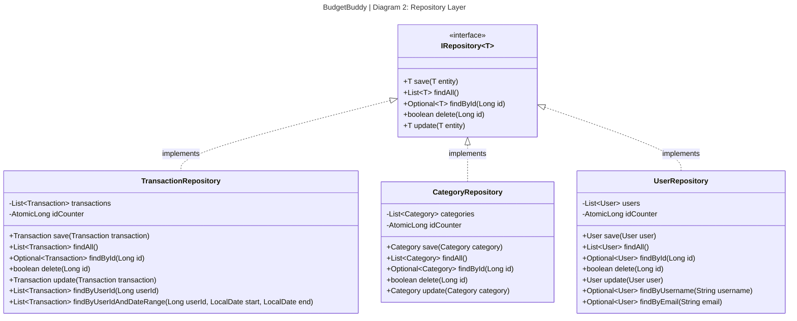
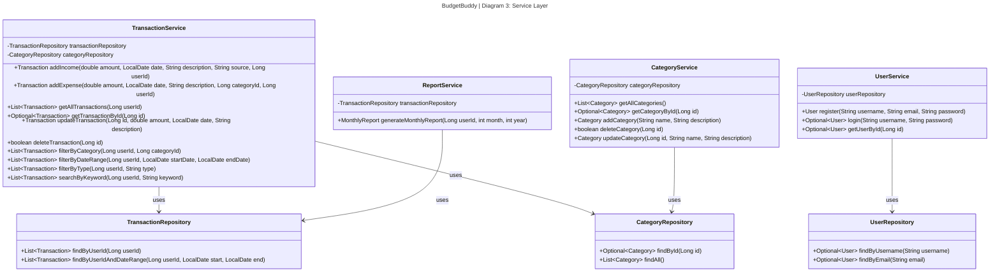
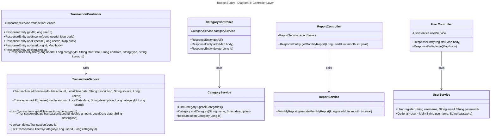

# BudgetBuddy — Class Diagrams (Eraser.io / Mermaid)

> Paste each ```mermaid block directly into [Eraser.io](https://app.eraser.io)
> using **New Diagram → Diagram as Code → Mermaid**.
>
> Five separate diagrams:
> 1. Model Layer
> 2. Repository Layer
> 3. Service Layer
> 4. Controller Layer
> 5. Full Overview

---

## Diagram 1 — Model Layer



---

## Diagram 2 — Repository Layer



---

## Diagram 3 — Service Layer



---

## Diagram 4 — Controller Layer



---

## Diagram 5 — Full Overview (All Layers)

```mermaid
---
title: "BudgetBuddy | Diagram 5: Full Overview"
---
classDiagram
    direction TB

    %% ── MODEL ──────────────────────────────────────────────
    namespace Model {
        class Transaction {
            <<abstract>>
            -Long id
            -double amount
            -LocalDate date
            -String description
            -Long userId
            +String getType()*
            +Long getId()
            +double getAmount()
            +LocalDate getDate()
            +String getDescription()
            +Long getUserId()
        }
        class Income {
            -String source
            +String getSource()
            +String getType()
        }
        class Expense {
            -Long categoryId
            -String categoryName
            +Long getCategoryId()
            +String getCategoryName()
            +String getType()
        }
        class Category {
            -Long id
            -String name
            -String description
            +Long getId()
            +String getName()
        }
        class User {
            -Long id
            -String username
            -String email
            -String password
            +Long getId()
            +String getUsername()
        }
        class MonthlyReport {
            -int month
            -int year
            -double totalIncome
            -double totalExpense
            +void generate(List~Transaction~ allTransactions)
            +double getBalance()
        }
    }

    %% ── REPOSITORY ──────────────────────────────────────────
    namespace Repository {
        class IRepository~T~ {
            <<interface>>
            +T save(T entity)
            +List~T~ findAll()
            +Optional~T~ findById(Long id)
            +boolean delete(Long id)
            +T update(T entity)
        }
        class TransactionRepository {
            +Transaction save(Transaction t)
            +List~Transaction~ findByUserId(Long userId)
            +List~Transaction~ findByUserIdAndDateRange(Long userId, LocalDate start, LocalDate end)
        }
        class CategoryRepository {
            +Category save(Category c)
            +List~Category~ findAll()
        }
        class UserRepository {
            +User save(User u)
            +Optional~User~ findByUsername(String username)
        }
    }

    %% ── SERVICE ─────────────────────────────────────────────
    namespace Service {
        class TransactionService {
            +Transaction addIncome(double amount, LocalDate date, String description, String source, Long userId)
            +Transaction addExpense(double amount, LocalDate date, String description, Long categoryId, Long userId)
            +List~Transaction~ getAllTransactions(Long userId)
            +boolean deleteTransaction(Long id)
            +List~Transaction~ filterByCategory(Long userId, Long categoryId)
            +List~Transaction~ filterByType(Long userId, String type)
            +List~Transaction~ searchByKeyword(Long userId, String keyword)
        }
        class CategoryService {
            +List~Category~ getAllCategories()
            +Category addCategory(String name, String description)
            +boolean deleteCategory(Long id)
        }
        class ReportService {
            +MonthlyReport generateMonthlyReport(Long userId, int month, int year)
        }
        class UserService {
            +User register(String username, String email, String password)
            +Optional~User~ login(String username, String password)
        }
    }

    %% ── CONTROLLER ──────────────────────────────────────────
    namespace Controller {
        class TransactionController {
            +ResponseEntity getAll(Long userId)
            +ResponseEntity addIncome(Long userId, Map body)
            +ResponseEntity addExpense(Long userId, Map body)
            +ResponseEntity update(Long id, Map body)
            +ResponseEntity delete(Long id)
            +ResponseEntity filter(Long userId, Long categoryId, String startDate, String endDate, String type, String keyword)
        }
        class CategoryController {
            +ResponseEntity getAll()
            +ResponseEntity add(Map body)
            +ResponseEntity delete(Long id)
        }
        class ReportController {
            +ResponseEntity getMonthlyReport(Long userId, int month, int year)
        }
        class UserController {
            +ResponseEntity register(Map body)
            +ResponseEntity login(Map body)
        }
    }

    %% ── RELATIONS ───────────────────────────────────────────

    %% Inheritance
    Transaction <|-- Income  : extends
    Transaction <|-- Expense : extends

    %% Interface implementation
    IRepository~T~ <|.. TransactionRepository : implements
    IRepository~T~ <|.. CategoryRepository    : implements
    IRepository~T~ <|.. UserRepository        : implements

    %% Model associations
    Expense       --> Category    : uses
    MonthlyReport --> Transaction : contains

    %% Service → Repository
    TransactionService --> TransactionRepository : uses
    TransactionService --> CategoryRepository    : uses
    ReportService      --> TransactionRepository : uses
    UserService        --> UserRepository        : uses
    CategoryService    --> CategoryRepository    : uses

    %% Controller → Service
    TransactionController --> TransactionService : calls
    CategoryController    --> CategoryService    : calls
    ReportController      --> ReportService      : calls
    UserController        --> UserService        : calls
```


